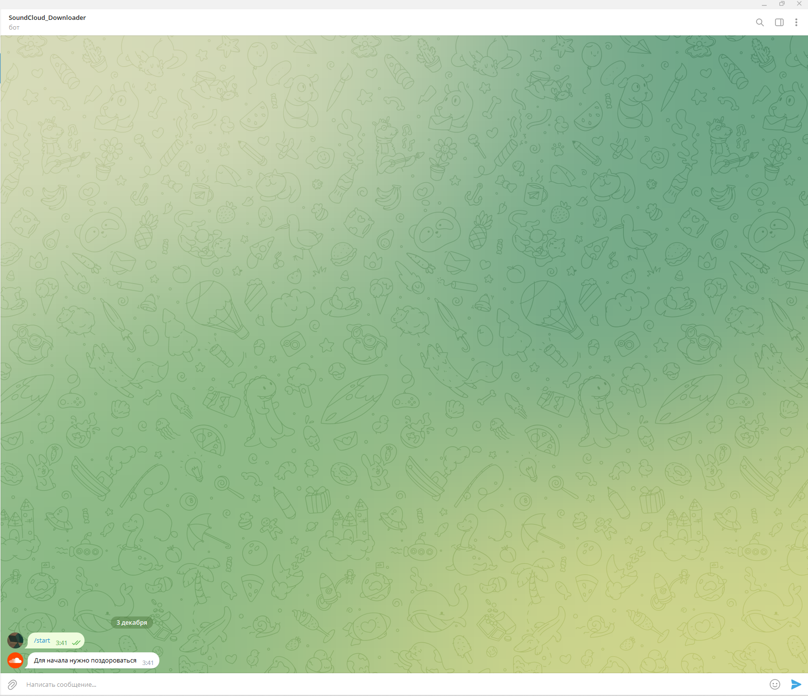

# SoundCloud Downloader
Telegram bot for downloading music from soundcloud.

## Тесты

Ветка `main`: 

Ветка `develop`: 

### Requirements
`requirements.txt`.

### Environment variables:
- BOTTOKEN= `access token for telegram bot management`
- PROXYCONF= `login:pass@ip:port`

## Docker

#### 1. Клонирование репозитория

`git clone https://github.com/11-kt/SoundCloud-Telegram_Bot.git`

#### 2. Папка проекта

`cd SoundCloud-Telegram_Bot`

#### 3. Построение образа

`docker build -t sctg .`

#### 4. Запуск

`docker run -t sctg`

### С первого октября сервис  `soundcloud.com` заблокирован на территории РФ!
Поэтому подключен прокси сервер.

Так как в проекте используются переменные среды GitHub, то запустить собранный самостоятельно образ не получится.
Используем заранее собранный образ: 

`docker pull kayat0n/soundcloud_bot:feature-7-add_Dockerfile`

`docker run b33a014dd927`

## Examples
Для начала начнем взаимодействие с ботом.
Для этого нужно написать ему по адресу: 

`t.me/S0undCl0udBot`.

Далее нажимаем кнопку: `ЗАПУСТИТЬ`

Теперь нужно поздороваться!

Бот откликается на слово: `Привет`

Отправляем ссылку на трек.

Когда бот получит ссылку, он уточнит формат скачивания.

После выбора формата, вы получите сообщение с аудиофайлом.

## License

[Apache](./LICENSE)